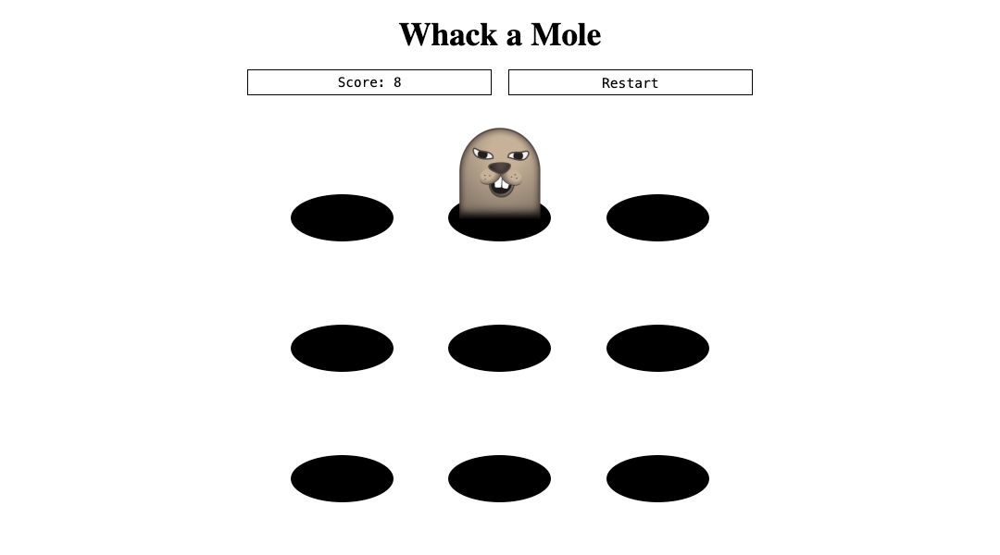

# Whack a Mole

Whack a Mole is a classic arcade game that consists of a cabinet with a play area and a
large mallet. Points are scored by whacking each mole as it appears. You will be making a
simple web version of this game!

A [live demo of the finished project](https://fsa-whack-a-mole.netlify.app/) is available
for you to reference.

## Requirements

It's up to you how you would like to build this, as long as your submission meets the
following requirements! Read them carefully _before_ you start working. As always, you
are highly encouraged to reference previous solutions.

> [!TIP]
>
> The hole and mole images are provided for you in the `public/` directory.
> See `index.css` for an example of how to use them as background images.

### Project Architecture

1. Your application is organized into separate components.
2. All game logic, such as starting the game or increasing the score, is managed inside a
   game context.
3. That game context is provided to your components via a provider and custom hook.
4. Arrays in state are not directly mutated.

### Features

5. When the page first loads, the user is greeted with a welcome screen containing
   instructions and a play button.
6. When the play button is clicked, the page switches to the main playing area, which
   displays a current score of 0, a restart button, and a number of holes. There is a
   single mole in one of the holes.
7. When the mole is clicked, it will move from its current hole to another randomly selected
   hole. (It's fine if the randomly selected hole happens to be the same hole.)
8. When the mole is clicked, the score goes up by 1.
9. If the user presses the restart button, they are sent back to the welcome screen.
10. If the user plays again after restarting, the score is reset to 0 and the mole moves to
    a new random position.

### Extensions

Make sure you've fulfilled all of the requirements before starting these extensions. These are optional but will be great practice!

1. Adjust the mole behavior so that it will always choose a new hole to go to when
   clicked. It should never randomly select the hole that it's already in.\
   _Hint: you will need to use a while loop!_
2. Keep track of high scores on the welcome screen. The user's current score is saved
   whenever they restart the game.

This next extension will require a technique that you'll learn in the next block! Come
back to this in the future.

3. Make the game timed. When the user presses play, they will now see a visible timer that
   starts at 15 seconds and counts down by 1 each second. When the timer hits 0, it should
   stop counting down and the user should no longer be able to click a mole.

   - Use [setInterval](https://developer.mozilla.org/en-US/docs/Web/API/Window/setInterval) for the countdown
   - Use [clearInterval](https://developer.mozilla.org/en-US/docs/Web/API/Window/clearInterval) to stop the timer
   - Use `useRef` to keep a reference to the interval to clear
   - Use `useEffect` to stop the game when the timer hits 0

## Submission

Please submit the link to your public GitHub repository.
